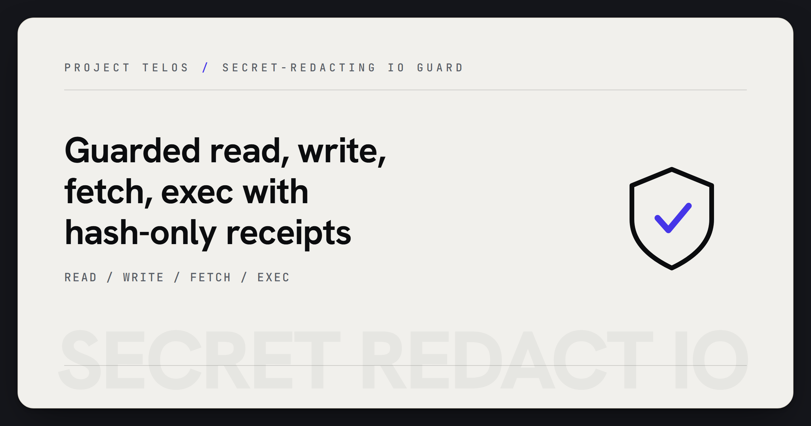

# Secret Redact IO

<p align="center">
  
</p>

> Safe IO for agent tools: read, write, fetch, and exec with redaction and receipts.

## Why it matters

Agents need IO, but raw IO can leak credentials or private payloads into logs and model context. Secret Redact IO gives tools a small guarded boundary: outputs are redacted, receipts are hash-only, and the original secret-shaped values are not archived.

## What to test first

- Read a file that contains a fake token and confirm the returned text is redacted.
- Run the dry-run write path and inspect the receipt before anything is persisted.
- Execute a subprocess that prints a fake secret and confirm stdout is redacted.

## Technical framing

> Stdlib-only guarded file/fetch/subprocess IO: strips API keys, tokens, and PEM keys; emits hash-only receipts.

[](LICENSE)


[](https://github.com/HarperZ9/secret-redact-io/actions/workflows/tests.yml)

[](https://harperz9.github.io)

`secret-redact-io` is a small Python SDK and CLI for guarded IO. It wraps file
reads, file writes, HTTP fetches, and subprocess execution with redaction and
hash-only audit receipts.

The default posture is conservative:

- user-facing output is redacted before it is returned;
- guarded writes persist redacted content by default;
- receipts store byte counts, hashes, status metadata, and redaction counts;
- receipts do not archive raw input or raw secret values.

## Install

```bash
python -m pip install secret-redact-io
```

## CLI

```bash
secret-redact-io read README.md --json
secret-redact-io write out.txt --content "note=hello" --dry-run --json
secret-redact-io fetch https://example.com --json
secret-redact-io exec --json -- python -c "print('hello')"
```

## Python API

```python
from secret_redact_io import read_text_guarded, run_guarded

read_result = read_text_guarded("README.md")
print(read_result.text)
print(read_result.receipt.to_json())

exec_result = run_guarded(["python", "-c", "print('hello')"])
print(exec_result.stdout)
```

## Usage

See [USAGE.md](USAGE.md) for an install line, the full CLI and Python API
surface, and worked examples with expected output. A runnable end-to-end
demo lives in [examples/demo.py](examples/demo.py).

## Boundary

This package is a public, self-contained guardrail utility. It does not include
credentials, secrets, or any deployment-specific configuration.

---
**Zain Dana Harper** — small tools with explicit edges.
[Portfolio](https://harperz9.github.io) · [HarperZ9](https://github.com/HarperZ9)
<sub>Built with Claude Code; reviewed, tested, and owned by me.</sub>

## For developers

Keep the public README, package metadata, and examples aligned with current behavior. Before opening a PR or pushing a release, run the local package verification path.

```bash
python -m pip install -e ".[test]"
python -m pytest
```
